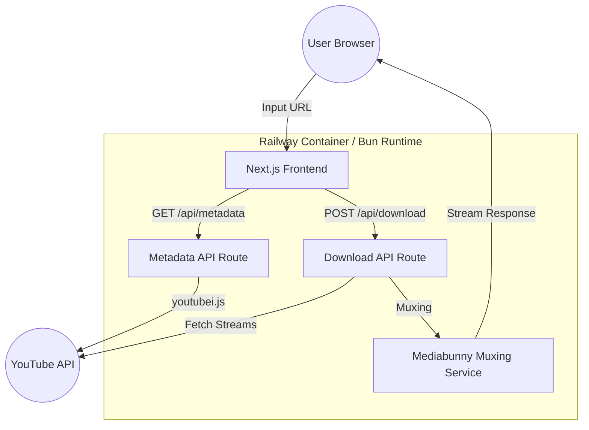

# Detailed Design: YouTube Video Downloader API

## Overview
This project is a web-based YouTube video downloader. It allows users to input a YouTube URL, retrieve metadata (title, formats, etc.), and download the video in high-quality formats (up to 4K) by muxing separate DASH video and audio streams server-side.

The application is built with **Next.js** running on **Bun**, utilizing **youtubei.js** for YouTube interaction and **Mediabunny** for high-performance, binary-free media muxing. It is designed for deployment on **Railway**.

## Detailed Requirements

### Functional Requirements
- **Metadata Retrieval**: The system must fetch and display video metadata (title, duration, thumbnail, available formats) when provided with a valid YouTube URL.
- **High-Quality Downloads**: The system must support downloading videos in resolutions higher than 720p (DASH streams) by merging video and audio tracks server-side.
- **Format Selection**: Users should be able to choose from a list of available video formats and qualities.
- **Audio Extraction**: Users should be able to download only the audio track (MP3/M4A).
- **Streaming Response**: Downloads should be streamed to the user's browser to minimize server memory footprint.

### Non-Functional Requirements
- **Performance**: Use Bun's fast runtime and Mediabunny's efficient muxing to ensure quick processing.
- **Simplicity**: Maintain a clean, minimal UI and a simple codebase.
- **Deployment**: Must be compatible with Railway's container environment.
- **No Binary Dependency**: Prioritize pure JavaScript/TypeScript libraries (like Mediabunny) to avoid complex FFmpeg binary management.

## Architecture Overview



### Components and Interfaces

#### 1. Frontend (Next.js)
- **Home Page**: A simple input field for the YouTube URL.
- **Video Info View**: Displays video details and a list of download buttons for various qualities.
- **Download Handler**: Manages the download state (loading, progress).

#### 2. Metadata API (`/api/metadata`)
- **Input**: `url` (query param)
- **Output**: JSON containing title, thumbnail, duration, and a filtered list of available formats.
- **Library**: `youtubei.js`

#### 3. Download API (`/api/download`)
- **Input**: `url`, `videoFormatId`, `audioFormatId`.
- **Process**:
    1. Fetch video and audio stream URLs using `youtubei.js`.
    2. Download streams to temporary files (or pipe them if supported by Mediabunny).
    3. Initialize Mediabunny `MP4Muxer`.
    4. Mux the streams into a single MP4 container.
    5. Return a `ReadableStream` to the client.

#### 4. Muxing Service
- **Logic**: Encapsulates the Mediabunny initialization and track combination logic.
- **Constraints**: No re-encoding (copy only) to ensure speed and server-side compatibility.

## Data Models

### Video Metadata
```typescript
interface VideoMetadata {
  id: string;
  title: string;
  duration: number;
  thumbnail: string;
  formats: StreamFormat[];
}

interface StreamFormat {
  id: string;
  quality: string;
  extension: string;
  type: 'video' | 'audio' | 'combined';
  size?: number;
}
```

## Error Handling
- **Invalid URL**: Return a 400 error with a clear message.
- **YouTube Bot Protection**: Catch and log InnerTube errors; provide feedback to the user if the video is restricted.
- **Muxing Failure**: Ensure temporary files are cleaned up even if the process fails.
- **Timeout**: Handle long-running downloads gracefully (Next.js/Railway limits).

## Testing Strategy
- **Unit Tests**: Test the Muxing Service with sample video/audio chunks to ensure valid MP4 output.
- **Integration Tests**: Mock `youtubei.js` responses to test the Metadata and Download API routes.
- **Manual Verification**: Verify downloads across different browsers and video qualities.

## Appendices

### Technology Choices
- **Bun**: Chosen for its high performance and built-in support for many Node.js APIs.
- **Next.js**: Provides a modern, full-stack framework with easy routing and React-based UI.
- **youtubei.js**: Selected for its robust handling of YouTube's InnerTube API and DASH support.
- **Mediabunny**: Replaces FFmpeg to eliminate binary dependencies and simplify the Railway deployment.

### Research Findings Summary
- **Merging**: DASH high-quality streams require separate fetches for video and audio.
- **Storage**: Railway's ephemeral `/tmp` is sufficient for intermediate storage during muxing.
- **Deployment**: Standard Bun + Next.js deployment on Railway works without custom Dockerfiles when using pure JS muxing.
